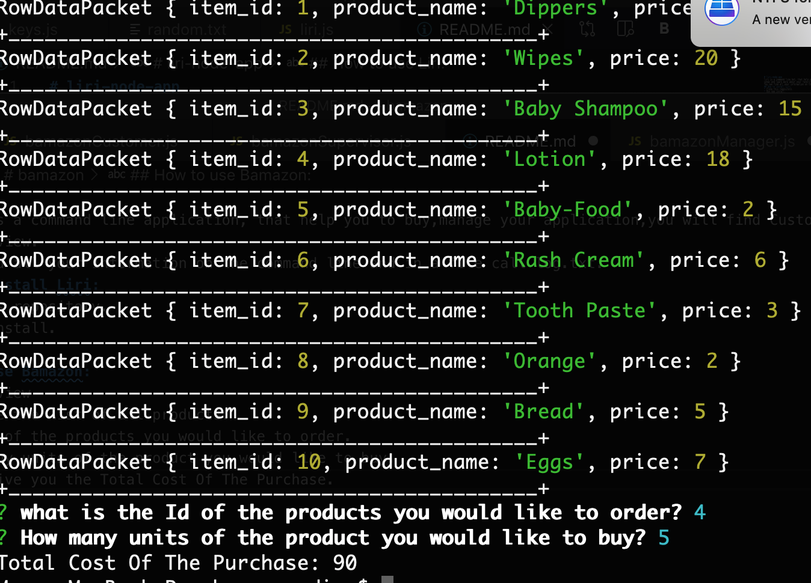
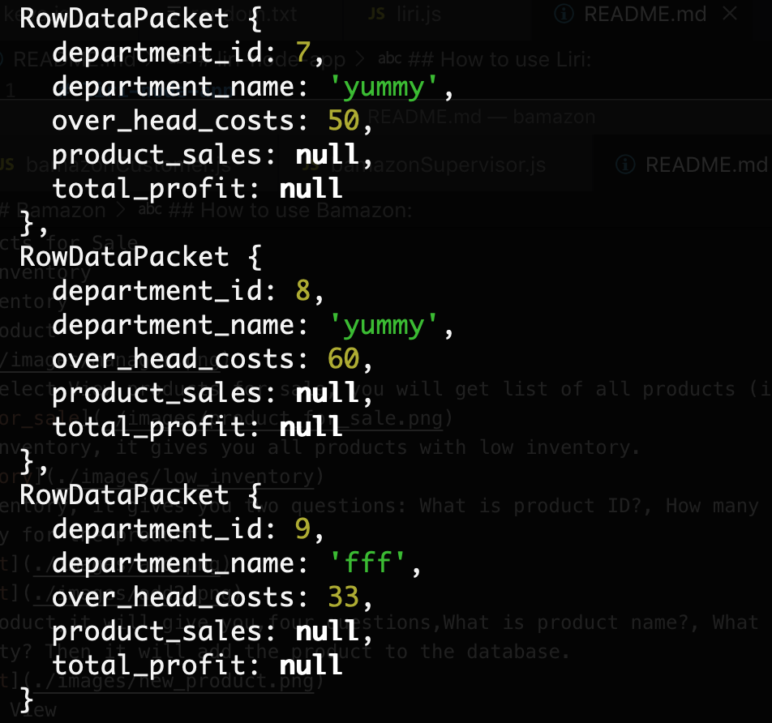

# Bamazon
* Bamazom is a command line application, that help you to buy,manage your application,you will find Customer View,Manager View and Supervisor View.  
You can find all your information on the command line and in a file call log.txt.
## How to install Liri:
* Clone this repository.
* Run npm install.
* Enjoy!!.
## How to use Bamazon:
* Customer View
You will see the list of all products.

Type the Id of the products you would like to order.

type How many units of the product you would like to buy.

Then it will give you the Total Cost Of The Purchase.

* Manager View
Select from the list of what you like to do.
1.View Products for Sale 
2.View Low Inventory 
3.Add to Inventory 
4.Add New Product 

* When you select View products for sale, you will get list of all products (item_id,product_name, stock_quantity,price).

* View low inventory, it gives you all products with low inventory.

* Add to Inventory, it gives you two questions: What is product ID?, How many units of the product you want to add? Then it will add the inventory for the product.

* Add New Product,it will give you,four questions,What is product name?, What is the department_name?, What is price?, What is the stock_quantity? Then it will add the product to the database.

* Supervisor View

When you select View Product Sales by Department you will see the product_sales and total_profit for each department.

When you select Create New Department, it will give you tow questions: What is department name?,What is the overhead costs?.

